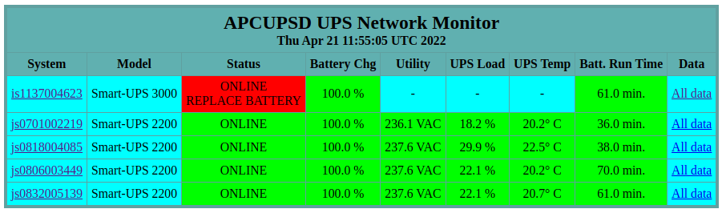

# Docker Swarm deployment of apcupsd-docker

Using Docker Swarm we can run multiple instances of the [apcupsd](http://www.apcupsd.org/) UPS monitoring daemon, across multiple physical hosts that each have one or more UPS devices connected via USB, all reporting to one central Web interface.

These instructions are based on [those from Charles Crossan](https://crossan007.dev/blog/linux/configuring-multiple-networked-apc-ups-devices/), extended to Docker Swarm deployment.

I have used Ubuntu Server 20.04 LTS throughout.

---

## Create udev rules

First we need to write custom udev rules on each host that has a UPS device connected to it via USB, so that we have permanent/static paths to those UPS devices even if the host reboots.

First look for `hiddev` devices in `/dev/usb`.

```
root@manager:~$ ls -lah /dev/usb

total 0
drwxr-xr-x  2 root root    160 Apr 20 09:28 .
drwxr-xr-x 21 root root   4.2K Apr 20 07:57 ..
crw-------  1 root root 180, 0 Apr 20 09:28 hiddev0
crw-------  1 root root 180, 1 Apr 20 09:28 hiddev1
crw-------  1 root root 180, 2 Apr 20 09:28 hiddev2
```

For each one, pull out the identifiable information (including serial number). Replace `hiddev0` with `hiddev1`, `hiddev2` etc. in turn.

```
root@manager:~$ udevadm info --attribute-walk --name=/dev/usb/hiddev0 | egrep 'manufacturer|product|serial' >> /lib/udev/rules.d/90-ups.rules
```

Open this newly created `90-ups.rules` file & write a rule for each UPS in the following format, using the output from the previous command. Once you have written the rule(s), either comment out (using #) or delete the lines produced by the previous command.

```
#    ATTRS{product}=="Smart-UPS 2200 FW:654.17.I USB FW:7.3"
#    ATTRS{serial}=="JS0818004085"
#    ATTRS{manufacturer}=="American Power Conversion"
#    ATTRS{manufacturer}=="Linux 5.4.0-109-generic xhci-hcd"
#    ATTRS{product}=="xHCI Host Controller"
#    ATTRS{serial}=="0000:00:14.0"
KERNEL=="hiddev*", ATTRS{manufacturer}=="American Power Conversion", ATTRS{serial}=="JS0818004085", OWNER="root", SYMLINK+="usb/JS0818004085_Smart-UPS_2200"
```

Now generate the symlinks in `/dev/usb` from these new rules you've written.

```
root@manager:~$ udevadm trigger --verbose --sysname-match=hiddev*
```

Check in `/dev/usb` to see that they have been created correctly.

```
root@manager:~$ ls -lah /dev/usb

total 0
drwxr-xr-x  2 root root    160 Apr 20 09:28 .
drwxr-xr-x 21 root root   4.2K Apr 20 07:57 ..
crw-------  1 root root 180, 0 Apr 20 09:28 hiddev0
crw-------  1 root root 180, 1 Apr 20 09:28 hiddev1
crw-------  1 root root 180, 2 Apr 20 09:28 hiddev2
lrwxrwxrwx  1 root root      7 Apr 20 09:28 IS1137004623_Smart-UPS_3000 -> hiddev0
lrwxrwxrwx  1 root root      7 Apr 20 09:28 JS0701002219_Smart-UPS_2200 -> hiddev2
lrwxrwxrwx  1 root root      7 Apr 20 09:28 JS0818004085_Smart-UPS_2200 -> hiddev1
```

---

## Install Docker Engine on all hosts

I recommend using [the official Docker repositories](https://docs.docker.com/engine/install/).

Consider adding a non-root user to the `docker` group, rather than running containers as the root user.

---

## Install Compose v2 on all hosts

Follow the [official instructions](https://docs.docker.com/compose/cli-command/#install-on-linux).

Note that we're using Compose v2. If you choose to install from your distribution repositories, make sure you have v2 not v1.

---

## Create a Docker Swarm

We will be creating a 'swarm' of multiple physical hosts each running Docker, where one physical host acts as the swarm 'manager' node & the other hosts run as swarm 'worker' nodes. You may wish to read over the [official documentation on Docker Swarm mode](https://docs.docker.com/engine/swarm/) first.

On the host that is going to be the manager node, run the following command to initiate the swarm. Substitute the IP address for that of your manager node (specifically for the interface it will use to communicate with other nodes in the swarm, in the case of multiple interfaces).

```
cj@manager:~$ docker swarm init --advertise-addr 10.42.0.1
```

This will output a command which you should copy & run on each worker node, to make them join the swarm.

```
cj@worker:~$ docker swarm join --token SWMTKN-1-0p4vgj96610a47bmrobhskl2olog5fz3rqekte1iydxfpg7sm2-3d23lu4gg6blonbca70a48ba4 10.42.0.1:2377
```

---

## Copy apcupsd-docker-swarm to each swarm node

Copy the `apcupsd-docker-swarm` folder (eg the folder within which this readme resides) to each node of the swarm. Inside it are two sub-folders, `apcupsd-daemon` & `apcupsd-webif`.

The manager node will run one instance of the `apcupsd-webif` container, in addition to zero-to-many instances of the `apcupsd-daemon` container (one for each locally attached UPS device). The manager node doesn't necessarily have to have any locally attached UPS devices.

Each worker node will run one-to-many instances of the `apcupsd-daemon` container (one for each locally attached UPS device).

On each node (manager & workers) the only thing you need to edit is the top-level `docker-compose.yml` file.

---

## Configure the manager node

Edit the top-level `docker-compose.yml` file on the manager node. Note that **you must use consistent indentation** in YAML files; I use 2 spaces throughout these examples.

First we define an attachable overlay network, which allows standalone containers within a swarm to communicate. We are dealing with standalone containers, we are *not* defining an actual swarm service.

```
networks:
  ups-overlay:
    driver: overlay
    attachable: true
```

Then we declare zero-to-many uniquely named instances of `apcupsd-daemon` (I use the serial numbers of the UPS units). For each one we first map the port that the daemon operates on within its container (3551) to a free port on the host, in the format `host:container`. Note that this configuration is per physical host, so each host can start mapping their daemons at `3551:3551`; we don't need to increment host ports *between* separate phsyical hosts.

Then we specify the path to the UPS device using the udev generated symlinks we defined before, again in the format `host:container`.

Next we provide a sensible name for this UPS device & finally we specify that we want this container attached to the overlay network we defined above.

Repeat this for each UPS device on the manager node.

```
  is1137004623:
    build:
      context: ./apcupsd-daemon
    ports:
      - "3551:3551"
    devices:
      - "/dev/usb/IS1137004623_Smart-UPS_3000:/dev/ups"
    environment:
      - UPSNAME=IS1137004623_Smart-UPS_3000
    networks:
      - ups-overlay
```
After we're done with any UPS devices on the manager node, we declare one instance of `apcupsd-webif`. We map the host port that we will use to access the container's Web server using the `host:container` format (we are using 8080 on the host in this example).

Next we specify the container names of all the `apcupsd-daemon` instances we want to monitor, in the `UPS_TO_MONITOR` list. Note that this list specifices the container names of *all* `apcupsd-daemon` instances across *all* nodes, not just this manager node. At this stage you should consider jumping ahead to [Configure each worker node](#Configure-each-worker-node) in order to decide on the names for their `apcupsd-daemon` containers, so that you can add them all to the `UPS_TO_MONITOR` list now.

Finally we attach this `apcupsd-webif` container to the overlay network as well.

```
  webif:
    build:
      context: ./apcupsd-webif
    ports:
      - 8080:80
    environment:
      - UPS_TO_MONITOR=is1137004623,js0701002219,js0818004085,js0806003449,js0832005139
    networks:
      - ups-overlay
```

Here is a full example file, for a manager node that has three locally connected UPS devices & monitors an additional two UPS devices connected to worker nodes, with the Web interface accessible on port 8080 on the host.

```
version: "3.9"

networks:
  ups-overlay:
    driver: overlay
    attachable: true

services:
  is1137004623:
    build:
      context: ./apcupsd-daemon
    ports:
      - "3551:3551"
    devices:
      - "/dev/usb/IS1137004623_Smart-UPS_3000:/dev/ups"
    environment:
      - UPSNAME=IS1137004623_Smart-UPS_3000
    networks:
      - ups-overlay
  js0701002219:
    build:
      context: ./apcupsd-daemon
    ports:
      - "3552:3551"
    devices:
      - "/dev/usb/JS0701002219_Smart-UPS_2200:/dev/ups"
    environment:
      - UPSNAME=JS0701002219_Smart-UPS_2200
    networks:
      - ups-overlay
  js0818004085:
    build:
      context: ./apcupsd-daemon
    ports:
      - "3553:3551"
    devices:
      - "/dev/usb/JS0818004085_Smart-UPS_2200:/dev/ups"
    environment:
      - UPSNAME=JS0818004085_Smart-UPS_2200
    networks:
      - ups-overlay
  webif:
    build:
      context: ./apcupsd-webif
    ports:
      - 8080:80
    environment:
      - UPS_TO_MONITOR=is1137004623,js0701002219,js0818004085,js0806003449,js0832005139
    networks:
      - ups-overlay
```

---

## Start the swarm manager

From the top level of the `apcupsd-docker-swarm` folder on the manager node, use Compose to start all of the containers. The `-d` flag tells the containers to run in detached (backgroud) mode, so they don't take over the terminal.

```
cj@manager:~/apcupsd-docker-swarm$ docker compose up -d
[+] Running 4/4
 ⠿ Container apcupsd-docker-swarm-is1137004623-1  Started                                                                
 ⠿ Container apcupsd-docker-swarm-js0818004085-1  Started                                                                
 ⠿ Container apcupsd-docker-swarm-webif-1         Started                                                                
 ⠿ Container apcupsd-docker-swarm-js0701002219-1  Started                                                                
```


Check that the swarm overlay network has been created, taking note of its name.

```
cj@manager:~/apcupsd-docker-swarm$ docker network ls
NETWORK ID     NAME                               DRIVER    SCOPE
zalte5w49yyy   apcupsd-docker-swarm_ups-overlay   overlay   swarm
683cf5aad480   bridge                             bridge    local
39d0edad4739   docker_gwbridge                    bridge    local
aed25c8e8804   host                               host      local
3krn7dyb8gu7   ingress                            overlay   swarm
0a3a05cbd411   none                               null      local
```
---

## Configure each worker node

Now edit the top-level `docker-compose.yml` file on each worker node.

Essentially what we have here is the same as on the manager node, except we omit the `apcupsd-webif` declaration & we use the name that we took note of in the previous step along with the `external` option when declaring the overlay network.

If you didn't already do this, add the container names you declare here for the `apcupsd-daemon` instances to the `UPS_TO_MONITOR` array in the `apcupsd-webif` declaration in the `docker-compose.yml` of the manager node. After doing this you will need to `docker compose down` followed by `docker compose up -d` on the manager node if the containers are already running as per the previous stage.

```
version: "3.9"

networks:
  ups-overlay:
    external: true
    name: apcupsd-docker-swarm_ups-overlay

services:
  js0806003449:
    build:
      context: ./apcupsd-daemon
    ports:
      - "3551:3551"
    devices:
      - "/dev/usb/JS0806003449_Smart-UPS_2200:/dev/ups"
    environment:
      - UPSNAME=JS0806003449_Smart-UPS_2200
    networks:
      - ups-overlay
  js0832005139:
    build:
      context: ./apcupsd-daemon
    ports:
      - "3552:3551"
    devices:
      - "/dev/usb/JS0832005139_Smart-UPS_2200:/dev/ups"
    environment:
      - UPSNAME=JS0832005139_Smart-UPS_2200
    networks:
      - ups-overlay
```

---

## Start each swarm worker

There appears to be a slight catch with discovery of overlay networks by swarm worker nodes when using Compose. If you run `docker network ls` on one of your worker nodes at this stage, you will not see the overlay network we created on the manager node, even though the worker node has joined the swarm.

```
cj@worker:~/apcupsd-docker-swarm$ docker network ls
NETWORK ID     NAME                         DRIVER    SCOPE
5a5fe29e37a5   bridge                       bridge    local
d41d33c0d5d4   docker_gwbridge              bridge    local
5fe77e1c6d04   host                         host      local
preyva1gohqe   ingress                      overlay   swarm
14826fc06d86   none                         null      local
```

If we try to run `docker compose up -d` on this worker node it will fail, because it can't see our overlay network. One workaround is to instantiate a Docker container that connects to the overlay network, but to do so direct from the command line rather than via a Compose file. Run the following, using the overlay network name that you took note of in the [Start the swarm manager step](#Start-the-swarm-manager) when running `docker network ls` on the manager node.

```
cj@worker:~$ docker run -itd --name alpine1 --net apcupsd-docker-swarm_ups-overlay alpine /bin/sh
```

This starts a detached Alpine Linux container called alpine1 & connects it to our swarm overlay network. As long as this container is running, our overlay network will be visible in `docker network ls` on the worker node & to any Compose command that tries to connect to it. Note that the network ID should match that which you see when running the same command on the manager node.

```
cj@worker:~$ docker network ls
NETWORK ID     NAME                               DRIVER    SCOPE
zalte5w49yyy   apcupsd-docker-swarm_ups-overlay   overlay   swarm
5a5fe29e37a5   bridge                             bridge    local
d41d33c0d5d4   docker_gwbridge                    bridge    local
5fe77e1c6d04   host                               host      local
3krn7dyb8gu7   ingress                            overlay   swarm
14826fc06d86   none                               null      local

```

We can now start the worker node using Compose, from the top level of the  `apcupsd-docker-swarm` folder.

Repeat this process for all worker nodes.

```
cj@worker:~/apcupsd-docker-swarm$ docker compose up -d
[+] Running 2/2
 ⠿ Container apcupsd-docker-swarm-js0832005139-1  Started                                                                
 ⠿ Container apcupsd-docker-swarm-js0806003449-1  Started                                                                
```

---

## Check the Web interface

Open a Web browser & navigate to [http://10.42.0.1:8080/apc/multimon.cgi](http://10.42.0.1:8080/apc/multimon.cgi) substituting the IP of your manager node & the port you chose if it was something other than 8080.


You should see something like the below, that shows all UPS devices across all swarm nodes.

